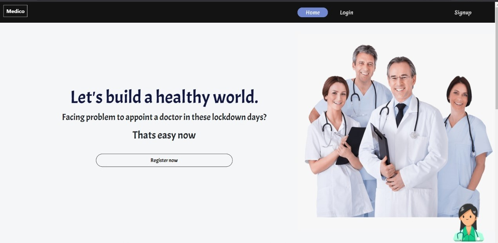

<h1>Medico App</h1>

> **Thanks to Team HAB59 and Judges for coming up with this hackathon and providing us a platform to exibit our skills**

```
This is under development phase
Complete practical(Production) build is still under development
```



### An all in one digital platform which bridges the gap between the patients and physicians for better care of your health during these days under monitorization from doctors. 

### [Watch demo video here 📺](#)

## 📌 Inspiration

COVID-19 has been here all across the globe since the past 7-8 months. Currently we have more than 20 million cases across the globe. With a vaccine still a long way away, the only solution is to stay home and work from home to be safe. Government has also informed us not to visit hospitals until an emergency occurs.

However, because of the absence of a smooth medical facilities during these lockdown days, many lives are facing problems. That's where the idea of Medico App came into existence.

## Idea

Medico App is an innovative step towards solving the problems of people who face difficulties to get medical facilities and monitor their health. 

## 🎯 What it does

Medico, where people can get monitored by the doctor and consult for better health. From rural areas with poor internet connection also, they can use Medico to get monitored by the docotrs easily. 

1. We have developed a progressive web app for both doctors and patients where they can register and request doctors to monitor them on daily basis. The web app is installable to the homepage and gives push notification which makes it unique to use.

2. We have also developed an android app for patients to easily give their daily data and monitor themselves by giving reminders and doctors can view the condition of patient and prescribe him according to that.

3. Next, coming to the features which are provided by Medico. Let's start with the patient side.

**Patient**
* The dashboard consists of all the graphs and information about his medicines through which he can monitor himself in a better way. For example the graph of his Blood Pressure, Diabetes, pulse rate and information about his medicines.

* Coming to android app, the dashboard gives an additional feature for patient to give reminder when to take medicines and all.

* Next, we have a doctors panel where patient can go through doctors profile and request for appointment according to his requirements.

* Upon confirmation from doctor, we have one prescription panel where patient can view his doctors who will monitor them and go to the prescription page and tell the doctors about his problem and get prescribed by them.

* In the prescription panel we are also giving feature to appoint for video call. Patient can request for a video call and can view his scheduled event details once the doctor scheduled it.

* Next, we give a diet panel where patient can get a healthy diet recommendation based on his local food for that particular day.

* Patient can also view its nearest hospital based on his location and get its details like ambulance number for emergency use.

**Doctor**
* Upon login, doctor will get his dashboard where he get the patients whom he was monitoring. He can view each patient graphs on daily basis and monitor him.

* Next, prescription panel is available where he can prescribe his patient upon monitoring his data on daily basis.

* Doctor can schedule his video appointment through Meet using Google calendar when requested by the patient.

4. Coming to rural uneducated people, we have developed a chatbot which can guide them to use the app. For minor consultation like common dieseases, chatbot can also provide you with the medicines details and the doctors details for easy use.

5. IVR hotline number facilites is also avialable for those who are located in the places with unstable internet connection and cannot use web or android app. They can get monitored by the doctor through hotline number facilitites.

## Screenshots

will be updated soon.

## How we built it

will be updated soon.

## Challenges we ran into

will be updated soon.

## Prerequisties

will be updated soon.

## Installation & Setup 

will be updated soon.

## Team Members
* Sourav Kunda            
* Ananya Aprameya
* Saiprava Raut
* Shubhadarshie Nanda

 **Made with ❤ Team techNoids**